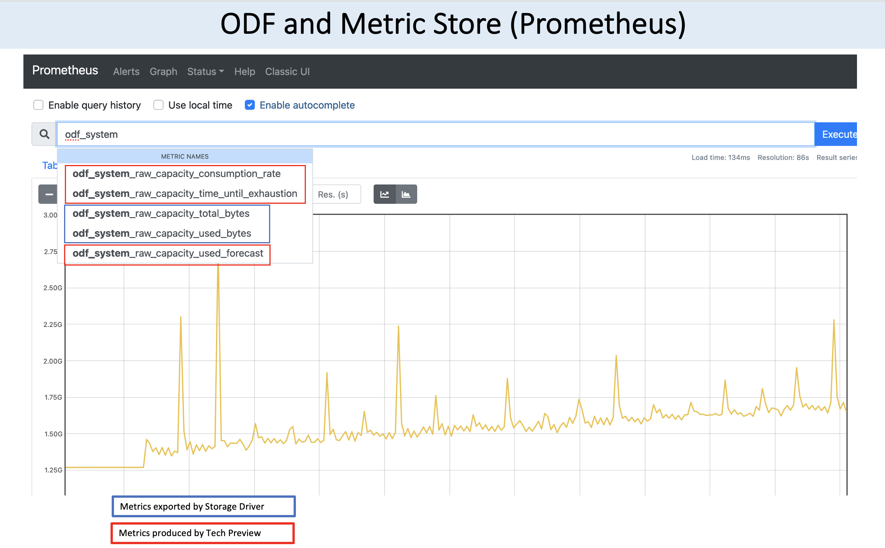

# IBM OpenShift Data Foundation (ODF) Technology Preview
The technology preview presented here uses Openshift Data Foundation (release 4.9 and beyond) APIs to implement Capacity Management use cases. 
* The key concept in ODF is "standardized metrics". A common metric name will enable initiative projects such as the ones related to the [Telemetry Working Group](https://openinfralabs.org/telemetry/) and also the example in this TechPreview.
* Sample storage capacity management uses ODF metrics to forecast and to plan:
  * When I many run out of storage?
  * How much storage space do I need for next year? 

In this TechPreview, we will use 2 ODF metrics:
* odf_system_raw_capacity_total_bytes
* odf_system_raw_capacity_used_bytes

and will produce 3 ODF metrics:
* odf_system_raw_capacity_rate_consumption
* odf_system_raw_capacity_time_until_exhaustion
* odf_system_raw_capacity_used_forecast

The result (could be seen from the Prometheus dashboard) is as follows:



# Usage
The [YAML file](src/odf-techpreview-capacity-planning.rules.yaml) contains the Prometheus recording rules to produce 3 metrics:
* **odf_system_raw_capacity_rate_consumption** - which calculates the rate of consumption of the given storage array (in bytes)
* **odf_system_raw_capacity_time_until_exhaustion** - which calculates the elapsed time from now until the given storage array run out of capacity (in seconds)
* **odf_system_raw_capacity_used_forecast** - which forecast in the future of total used raw capacity of the given storage array

Deploy the TechPreview by applying the YAML file:
```
oc apply -f odf-techpreview-capacity-planning.rules.yaml
```
 


